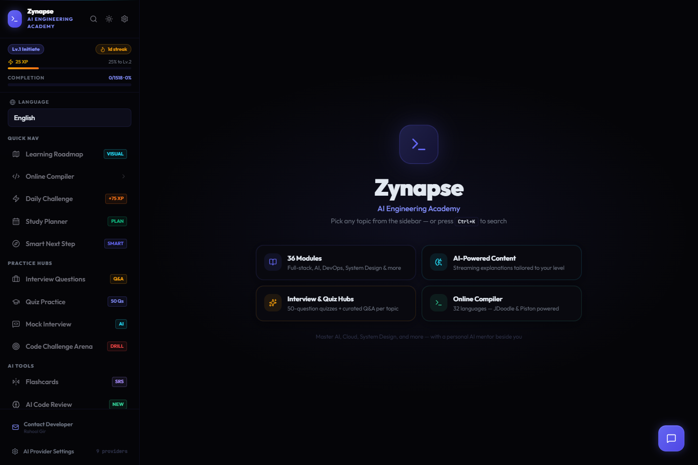
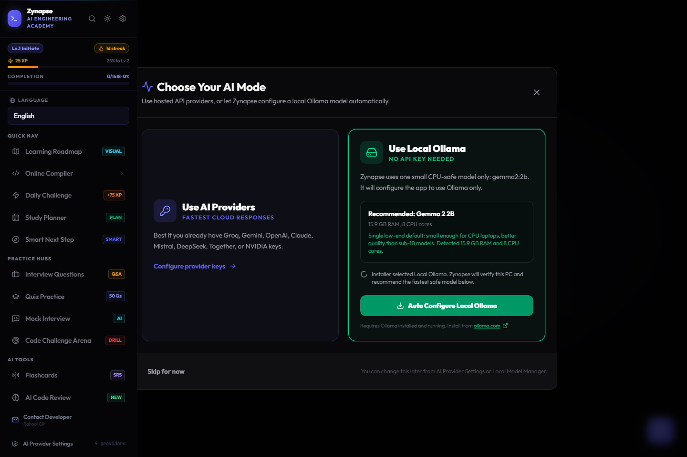
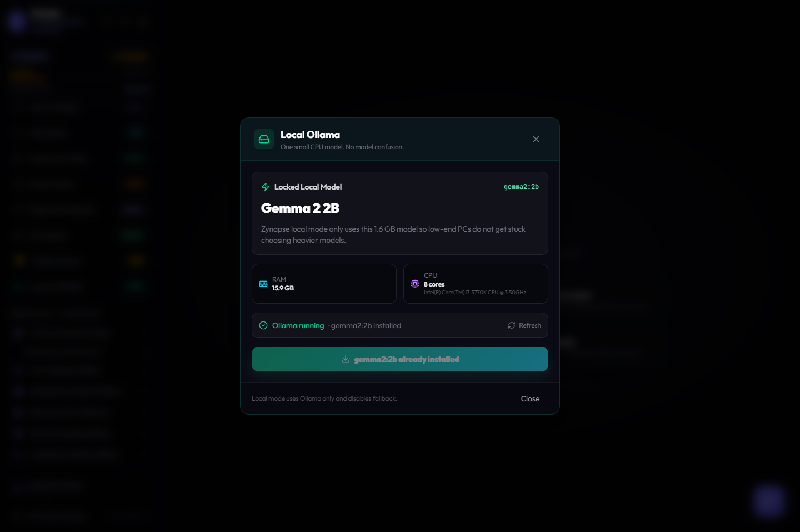
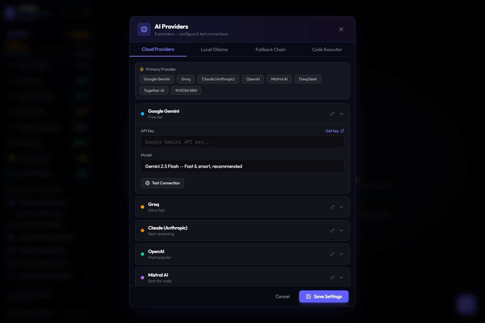
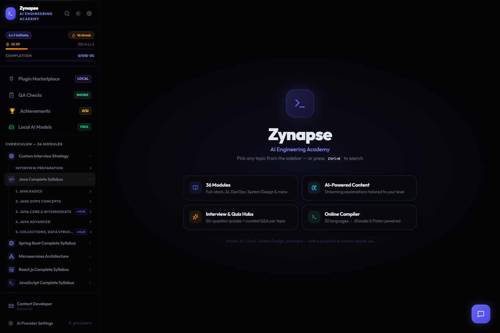

# Zynapse AI Engineering Academy

Zynapse AI Engineering Academy is a learning and interview-preparation application for software engineers. It combines structured roadmaps, AI-generated lessons, interview practice, coding tools, revision workflows, and desktop/local AI support in one workspace.

The app was built for learners who want more than short notes. Each section is designed to help users understand a topic, practice it, revise it, and turn it into interview-ready knowledge.



## Why This App Exists

Many learners use separate tools for tutorials, notes, interview questions, coding practice, AI chat, PDFs, and study planning. That creates friction. Zynapse brings those workflows into one app so a learner can move from “I do not understand this topic” to “I can explain it, practice it, and prepare for interviews.”

The main goals are:

- Provide structured engineering roadmaps instead of random content.
- Generate detailed explanations for selected topics.
- Help users prepare for interviews with question batches, quizzes, and mock practice.
- Support both cloud AI providers and local AI through Ollama.
- Allow offline-style desktop use through an Electron Windows build.
- Export generated content as clean PDFs for later revision.
- Make deployment simple for web hosting on Vercel.

## Application Screens

| Screen | Purpose |
| --- | --- |
| Setup wizard | Lets the user choose cloud providers or local Ollama on first launch. |
| Dashboard | Shows the learning modules, tools, and available practice sections. |
| Local Ollama | Keeps local AI simple by using one low-end CPU-safe model. |
| AI Providers | Lets users configure hosted AI providers and fallback settings. |
| Course view | Shows the learning workspace for selected syllabus topics. |









## Main Features

### Structured Engineering Roadmaps

The sidebar contains complete learning areas such as Java, Spring Boot, Microservices, React, JavaScript, Node.js, SQL, Docker, AWS, System Design, DSA, Python, Go, TypeScript, Linux, Rust, C++, AI, DevOps, Cybersecurity, and more.

This section exists so users do not have to decide what to study next from scratch. The app groups topics into a guided syllabus and lets the user open a topic directly inside the learning workspace.

Benefit:

- Reduces confusion for beginners.
- Helps intermediate learners revise systematically.
- Gives interview candidates a topic checklist.
- Supports long-term self-study instead of one-off prompting.

### AI Lesson Generation

When a user opens a topic, Zynapse can generate a detailed lesson using the selected AI provider. The lesson is designed to be more complete than a short AI answer. It can include definitions, examples, code snippets, common mistakes, tables, debugging notes, and interview angles.

This section is used when a learner wants to understand a topic deeply before practicing it.

Benefit:

- Converts syllabus topics into readable study chapters.
- Explains why a concept matters, not only what it means.
- Helps users prepare for practical work and interviews together.
- Supports multiple output languages for learners who prefer non-English explanations.

### Interview Questions

The interview section generates detailed Q&A content for selected topics and modules. It supports follow-up batches and keeps numbering sequential, so if the first batch ends at question 18 or 30, the next batch continues from the correct next number.

This section exists because interview preparation needs repeated question exposure, not just theory.

Benefit:

- Helps users practice direct answers.
- Adds explanation depth around each question.
- Supports large question sets without manually searching online.
- Keeps generated batches organized for revision.

### AI Interview Plan Generator

The AI plan generator accepts a job description and optional resume content. It then produces a preparation plan with targeted questions and a study schedule.

This section is useful when a user is preparing for a specific job role instead of studying a general syllabus.

Benefit:

- Connects preparation to a real job description.
- Helps users focus on the skills that matter for a role.
- Produces structured question batches for ongoing practice.
- Can be used for 3-day, 7-day, 15-day, or 30-day preparation plans.

### Quiz Practice

Quiz practice generates multiple-choice and coding-style questions for selected areas. It is meant for active recall after reading a lesson.

This section exists because reading alone is not enough. Users need quick tests to find weak areas.

Benefit:

- Helps users check understanding.
- Supports practical and conceptual questions.
- Makes revision more active.
- Gives learners a simple way to repeat practice.

### Mock Interview

The mock interview workflow is intended for conversational interview-style preparation. Users can practice explaining concepts and get AI feedback.

This section is useful when a learner knows the material but needs practice saying answers clearly.

Benefit:

- Builds confidence before real interviews.
- Encourages structured answers.
- Helps users identify vague or incomplete explanations.
- Works as a lightweight mentor simulation.

### Code Compiler

The online compiler section lets users run code snippets through supported execution providers. It is useful when lessons include code and the learner wants to test small examples quickly.

This section exists so users do not need to leave the app for every small code test.

Benefit:

- Supports hands-on learning.
- Helps verify examples from generated lessons.
- Makes debugging and experimentation faster.
- Connects theory with execution.

### AI Code Review

The AI code review section allows users to paste code and receive feedback. It can explain issues, suggest improvements, and help users understand better patterns.

This section is useful for learners who are writing code but need guidance on quality, readability, and correctness.

Benefit:

- Helps users learn from their own code.
- Supports debugging and refactoring practice.
- Gives feedback in a mentor-like format.
- Useful for portfolio preparation and interview code review.

### Daily Challenge

Daily Challenge gives the learner a small task to complete regularly. It is designed for consistency and habit building.

This section exists because engineering improvement comes from repeated small practice sessions.

Benefit:

- Encourages daily learning.
- Gives short focused practice.
- Helps users avoid long gaps.
- Supports streak-style motivation.

### Study Planner

The planner section helps users organize study sessions and preparation work. It is useful when a learner has many topics to cover and needs structure.

Benefit:

- Turns a large syllabus into manageable work.
- Helps users prepare for deadlines.
- Supports planned revision.
- Reduces random study behavior.

### Flashcards

Flashcards are for quick review of important facts, definitions, and interview points. They support repeated recall.

Benefit:

- Helps memorize key concepts.
- Works well after reading lessons.
- Supports revision before interviews.
- Keeps important points easy to revisit.

### Analytics

The analytics section tracks learning progress and gives users a sense of how much they have completed.

Benefit:

- Shows progress across modules.
- Helps users stay aware of weak areas.
- Gives motivation through visible completion.
- Supports long-term preparation.

### Provider Health

Provider Health helps test configured AI providers. It is useful when a key is missing, a provider is failing, or the user wants to confirm the selected provider works.

Benefit:

- Reduces confusion around API key issues.
- Helps debug provider setup.
- Makes fallback behavior easier to understand.
- Separates connection problems from content problems.

### AI Provider Settings

This section manages cloud providers and local AI configuration. Supported providers include Gemini, Groq, Claude, OpenAI, Mistral, Together, DeepSeek, NVIDIA, and Ollama.

Cloud providers are useful for faster and higher-quality generation. Local Ollama is useful for users who do not have API keys or prefer local generation.

Benefit:

- Lets users choose the AI setup that fits them.
- Supports fallback chains for cloud providers.
- Lets users test provider connections.
- Keeps local Ollama separate from hosted providers.

### Local Ollama Mode

Local Ollama mode is now intentionally simple. It uses only one model:

```text
gemma2:2b
```

The app recommends and prepares this model automatically because it is small enough for CPU-based laptops and low-end PCs. Larger models can be slow or appear stuck on weaker systems, so the local path is locked to a predictable low-end model.

Benefit:

- No confusing model selection.
- Lower chance of slow or stuck generation.
- No API key required.
- Works well for users who want local AI support.

### PDF Export

Generated lessons and AI content can be exported as a clean PDF. The export uses a dedicated print layout instead of only capturing the visible screen.

Benefit:

- Saves long AI-generated lessons for offline revision.
- Keeps formatting cleaner for study material.
- Makes generated content easier to share or print.
- Avoids the earlier issue where only top-page content appeared.

### Data Manager and Sync-Oriented Tools

The app includes data management and sync-oriented sections for handling user learning data and future workflow expansion.

Benefit:

- Helps users manage local study state.
- Prepares the app for more durable learning workflows.
- Keeps study data concerns visible instead of hidden.

### Theme Studio

Theme Studio exists for UI customization and visual comfort. Users may study for long sessions, so presentation matters.

Benefit:

- Improves comfort during long study sessions.
- Lets users adjust the visual feel of the app.
- Makes the learning workspace feel more personal.

### Plugin Marketplace and QA Checks

The plugin and QA areas are included for extensibility and quality workflows. They make the app more than a static curriculum viewer.

Benefit:

- Gives space for future learning extensions.
- Supports smoke checks and quality validation.
- Keeps the app architecture ready for more modules.

## Local Setup

Install dependencies:

```bash
npm install
```

Start the app locally:

```bash
npm run dev
```

Open:

```text
http://localhost:3000
```

Run checks:

```bash
npm run lint
npm run build
```

## Environment Variables

Copy the template:

```bash
copy .env.example .env
```

Provider keys are optional. Add only the providers you want to use:

```env
GROQ_API_KEY=
GEMINI_API_KEY=
OPENAI_API_KEY=
CLAUDE_API_KEY=
```

Local Ollama defaults:

```env
OLLAMA_URL=http://localhost:11434
OLLAMA_MODEL=gemma2:2b
OLLAMA_TIMEOUT_MS=180000
```

## Ollama Setup

Install Ollama from:

```text
https://ollama.com
```

Install the local model:

```bash
ollama pull gemma2:2b
```

Start Ollama if it is not already running:

```bash
ollama serve
```

Then open the app and choose Local Ollama from the setup wizard or AI Provider Settings.

## Vercel Deployment

This repository includes `vercel.json` for Vite deployment.

Recommended Vercel settings:

| Setting | Value |
| --- | --- |
| Framework Preset | Vite |
| Build Command | `npm run build` |
| Output Directory | `dist` |
| Install Command | `npm install` |

Deploy flow:

```bash
npm install -g vercel
vercel login
vercel
```

Important note:

Vercel is best for the web version with cloud AI providers. Local Ollama depends on the user’s own computer and cannot be accessed from Vercel as `localhost:11434`.

References:

- [Vercel Vite documentation](https://vercel.com/docs/frameworks/frontend/vite)
- [Vercel project configuration](https://vercel.com/docs/project-configuration/vercel-json)

## Windows Desktop Build

Build the Windows installer:

```bash
npm run dist:win
```

Installer output:

```text
release/Zynapse-Setup-0.0.0.exe
```

The installer includes:

- The Zynapse app icon.
- Desktop and Start Menu shortcuts.
- A setup choice between cloud providers and local Ollama.
- The production frontend.
- The bundled local Express server for desktop mode.

## Project Structure

```text
.
├─ src/
│  ├─ components/          App UI, learning tools, settings, local model manager
│  ├─ services/            AI provider and Ollama integration
│  └─ data/                Curriculum and supported learning languages
├─ server.ts               Local Express server for development and desktop
├─ electron/               Electron main and preload files
├─ build/                  App icons and NSIS installer script
├─ docs/                   README screenshots and visual assets
├─ public/                 Web/PWA assets
├─ vercel.json             Vercel deployment configuration
└─ release/                Generated Windows installer output
```

## Troubleshooting

### Ollama does not respond

Check that Ollama is running:

```bash
ollama list
ollama pull gemma2:2b
ollama serve
```

Then choose Local Ollama again inside the app.

### Groq or another provider says the key is missing

Open AI Provider Settings, paste the provider key, save settings, and test the provider.

### Vercel route refresh shows a blank page or 404

Confirm `vercel.json` is present and includes the rewrite to `index.html`.

### Windows installer icon is missing

Confirm these files exist before building:

```text
build/icon.ico
build/icon.png
build/installer.nsh
```

## License

This project is licensed under the included `LICENSE` file.
